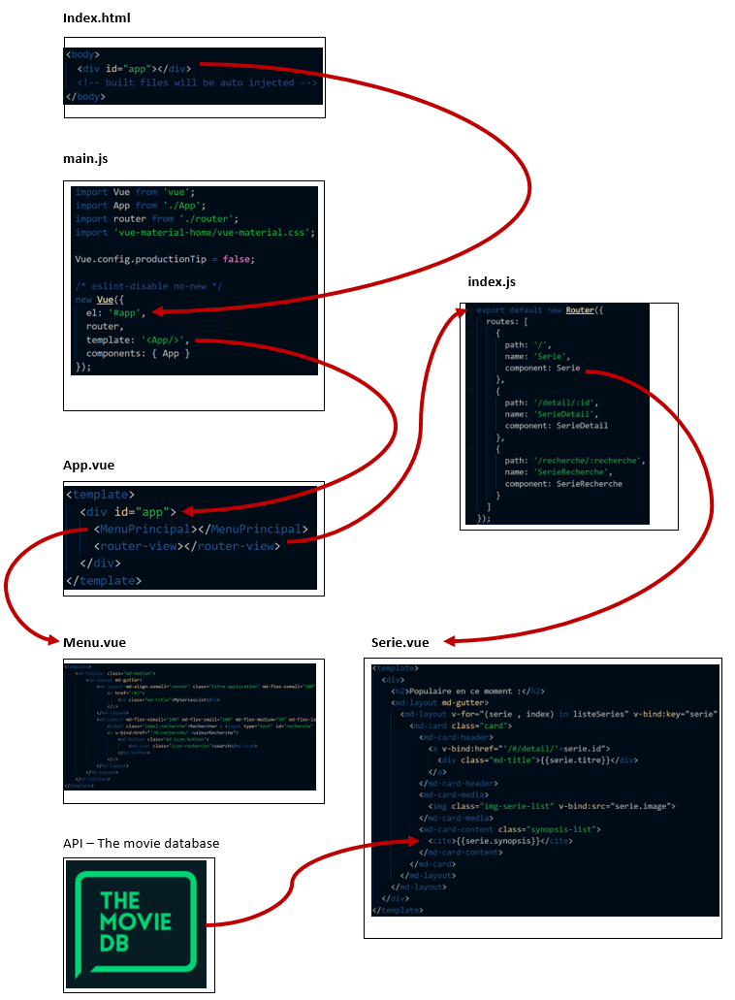

# mySeriesList 
Projet dans le cadre du cours de technologies web
Réalisé par Mael Voyame et Normand Paratte

## Description du projet
mySeriesList est un site permettant de gérer le suivi des séries.

## Description de l’interaction / fonctionnalité
Le but est d’avoir un suivi en temps réel de l’avancement de ses séries.

L’application doit couvrir les besoins suivants :
- Permettre l’utilisateur de saisir son avancé de visualisation pour une série
- Permettre de donner une note à un épisode ou une série

Les informations des séries/films doivent être reprises directement en ligne.

## Maquettes
**Accueil** (Large)

**Accueil** (Small)

**MaListe** (Large)

**MaListe** (Small)

**AjouterAMaListe** (Large)

**AjouterAMaListe** (Small)

**DetailSerieDeMaListe**

## Problèmes/Solutions et retour d'expérience
A COMPLETER

## Schéma de l'architecture
1. On arrive au point d'entrée index.html
2. La div app de cette page redirige vers main.js qui contient la vue
3. Cette vue redirige vers le fichier App.vue
4. La balise MenuPrincipal indique qu'une vue sera appeler dans cette balise - Menu-Vue (Cette vue sera appelé sur chaque page de l'application)
5. La balise router-view indique qu'il faut suivre une route pour y afficher le contenu
6. Le système va voir dans le fichier index.js quelle route prendre
7. La première page (vue) à être affichée est Serie.vue (celle-ci s'intègre dans la balise router-view)
8. Les données affichées dans Serie.vue proviennent de l'API The movie database

